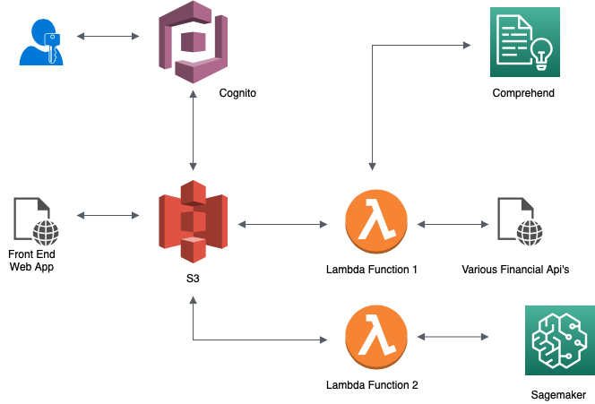

# Stockmarket-WebApp

# Summary

The web app is a AWS based serverless cloud application that allows users to analyze current trending stocks and make informed investment decisions.

  -Users will login using Cognito to a frontend hosted on a S3 Bucket through Cloudfront to maintain HTTPS protocols
  
  -The lambda functions allow users to interact with the Yahoo, Finnhub, Alpha Vantage - APIs

  -Users will be able to see daily Active/Gainers/Losers Stocks and see relevant news on these stocks.

  -Users will be able to see the market sentiment using these news articles with Comprehend

  -Users will be able to predict the performance of certain stocks using Sagemaker
  
  -AWS services used: S3, API Gateway, Cognito, Cloudfront, Sagemaker, Comprehend 
    
- Architecture Diagram

